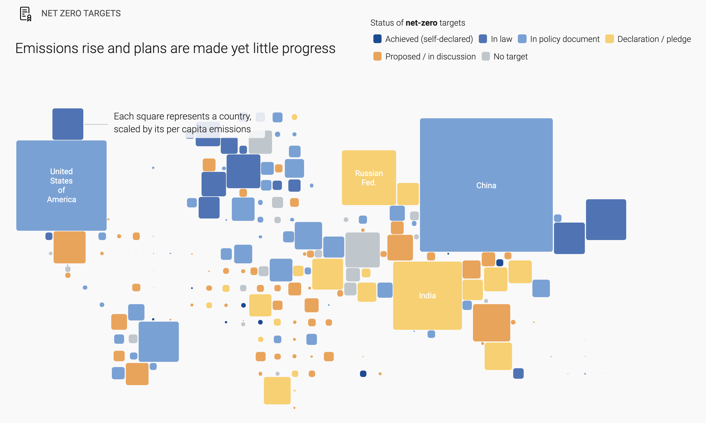

# Màster in Data Science UdG: Hackathon Infoviz and Project Management

 

This hackathon is a shared event between the Information Visualization and Data Science Project Management subjects with support from the [ViT Foundation](https://www.fundaciovit.org/).

**💡 What we want to solve:**

We want to propose a **new climate change metric**, **sea surface temperature anomalies**, based on **NASA's existing sea surface temperature data**, and use it as part of a country-by-country display of climate change statistics —the display will paint a picture of how we're affecting the climate, what's happening to it, and how we're addressing the climate emergency.

**🔍 Specifically ...**

* How to calculate the metric every time new monthly data rolls in.
* How to identify interesting 'hotspots' (and/or 'coldspots').
* How to break the data by country.
* What to say about it and how to display it.

**🧑‍🎓 What you will learn:**

* To wear different hats in a project: data analyst, data storyteller, project manager, researcher ...
* To collaborate with new teams and across teams —everyone has something that other teams need and needs something from other teams.
* To set realistic, yet aspirational expectations.
* To set and follow best practices for technical collaborations.
* To process, analyze and visualize geospatial data.
* To present results to stakeholders.

**✌️ You could try:**

*We suggest you switch project management tasks around. For example, one of you does pre-hackathon tasks, one handles monitoring tasks in the morning of the hackathon, one handles the afternoon. The remaining team mate can play the product owner presenting to stakeholders at the end of the day.*

**📅 Pre-hackathon stuff:**

* Read this repo in detail
* Meet to discuss and distribute roles
* Decide on the communication channels, management and documentation tools
* Set up your computer if you need to download or install any software —don't do it the day of the hackathon, please!

> **⚠ IMPORTANT NOTE:**  
> The entire group will collaborate on the same repo, so read the [Collaboration recommendations](#collaboration-recommendations).

## Project background

This project is part of a country-by-country exploration of climate change metrics. Among those metrics we'll have:

* GHG emissions: latest, per capita, and trend since 1970
* Latest land surface temperature anomalies
* Latest sea surface temperature anomalies 👈 **OUR FOCUS**
* Climate risk index
* Detailed net-zero targets *(regional and city-level data where available)*
* And about half a dozen more

> **⚠ IMPORTANT NOTE:**  
> **Again, our focus for this hackathon** is *ONLY* the **'Latest sea surface temperature anomalies'** metric!

Still in ideation, the overall project could become the next phase of a series which includes [this interactive](https://www.unep.org/explore-topics/climate-action/what-we-do/climate-action-note/state-of-climate.html):

[](https://www.unep.org/explore-topics/climate-action/what-we-do/climate-action-note/state-of-climate.html "Climate Action Note")

## OUR FOCUS: Sea surface temperature

Our ['raw data'](https://mitpress.mit.edu/books/raw-data-oxymoron) is NASA's sea surface temperature product, which shows the temperature of the top millimeter of the ocean's surface. Scientists monitor sea surface temperature because the ocean's warmth influences Earth's climate system in many different ways. The Moderate Resolution Imaging Spectroradiometer (MODIS) instruments aboard NASA's Terra and Aqua satellites collect global measurements of sea surface temperature accurate to within half a degree Celsius.

Here're [more detailed explanations about the data](https://neo.gsfc.nasa.gov/view.php?datasetId=MYD28M).

### About the data

You can find the data starting Jan. 2012 as `gzipped CSVs` in [`./data/raw/SST-CSVs`](data/raw/SST-CSVs)

The `CSV` is a 3,600 × 1,800 grid (equirectangular projection) with temperatures in Celsius. `99999.0` represents land or an empty value. A single row looks like this 👇:

```json
27.13,27.13,27.13,26.99,27.13,27.13,27.13,27.13,27.13,27.13,27.13,27.13,27.13,27.13,26.99,26.99,26.99,26.99,26.84,26.84,26.84,26.84,26.84,26.7,26.84,26.84,26.84,26.84,26.84,26.84,26.84,26.84,26.84,26.84,26.99,26.84,26.84,26.84,26.7,26.7,26.7,26.7,26.7,26.84,26.84,26.84,26.84,26.84,26.7,26.7,26.55,26.55,26.55,26.41,26.41,26.41,26.41,26.41,26.41,26.26,26.26,26.26,26.26,26.26,26.41,26.41,26.41,26.26,26.26,26.41,26.26,26.26,26.41,26.41,26.41,26.41,26.41,26.41,26.41,26.41,26.41,26.41,26.55,26.55,26.55,26.55,26.55,26.55,26.55,26.55,26.55,26.55,26.55,26.55,26.55,26.55,26.41,26.55,26.7,26.55,26.7,26.7,26.7,26.55,26.55,26.55,26.55,26.41,26.41,26.41,26.41,26.26,26.26,26.11,26.11,26.11,26.11,26.11,26.11,26.11,26.11,26.11,26.11,26.11,26.11,26.11,26.11,26.26,26.26,26.26,26.26,26.26,26.26,26.11,26.11,26.26,26.26,26.26,26.26,26.11,26.26,26.26,26.41,26.26,26.41,26.41,26.55,26.41,26.55,26.55,26.55,26.55,26.55,26.41,26.41,26.41,26.41,26.26,26.26,26.26,26.26,26.26,26.41,26.41,26.41,26.41,26.26,26.26,26.11,26.11,26.11,26.11,26.11,26.11,25.97,25.97,25.97,25.97,25.97,25.97,25.97,25.82,25.82,25.82,25.82,25.82,25.82,25.97,25.97,25.97,25.97,25.97,25.97,25.97,25.82,25.82,25.68,25.68,25.68,25.68,25.68,25.53,25.53,25.68,25.68,25.68,25.68,25.68,25.53,25.53,25.53,25.53,25.53,25.39,25.39,25.39,25.39,25.39,25.24,25.24,25.24,25.24,25.24,25.39,25.39,25.39,25.39,25.24,25.39,25.39,25.39,25.39,25.39,25.24,25.39,25.24,25.24,25.24,25.24,25.24,25.24,25.39,25.24,25.24,25.24,25.24,25.24,25.53,25.24,25.24,25.24,25.24,25.24,25.24,25.24,25.24,25.24,25.24,25.24,25.09,25.09,25.24,25.24,25.39,25.39,25.39,25.24,25.24,25.09,24.95,24.95,24.8,24.8,25.09,25.09,25.09,24.95,24.95,24.8,24.95,24.8,24.66,24.66,24.8,24.66,24.8,24.66,24.66,24.66,24.51,24.51,24.66,24.51,24.51,24.51,24.51,24.66,24.66,24.8,24.8,24.95,24.95,24.95,24.95,24.95,24.95,24.95,24.95,25.09,25.09,25.09,25.09,25.09,25.09,24.95,24.95,24.95,24.95,24.8,24.66,24.66,24.66,24.51,24.37,24.37,24.22,24.07,24.07,24.07,24.07,24.07,24.07,24.22,24.07,24.07,24.07,24.07,23.93,24.07,24.07,23.93,23.93,23.78,23.93,24.07,24.07,24.07,23.93,23.93,23.78,23.78,23.64,23.49,23.49,23.64,23.64,23.49,23.64,23.35,23.35,23.35,23.49,23.93,23.64,23.64,23.78,23.78,23.64,23.64,23.64,23.78,23.64,23.49,23.49,23.35,23.35,23.2,23.35,23.49,23.2,23.2,23.06,23.2,23.06,23.2,23.06,22.91,22.76,22.76,22.91,22.91,22.91,22.91,22.91,22.76,22.91,22.91,22.91,22.91,22.91,22.91,22.91,23.06,23.2,23.06,23.06,23.06,23.06,22.91,22.76,22.91,22.76,22.91,23.06,23.06,23.06,23.06,23.06,23.06,23.2,23.2,23.2,23.2,23.2,23.49,23.93,23.93,24.07,23.93,24.22,24.51,24.07,23.93,23.78,23.78,23.78,23.78,23.78,23.64,23.35,23.06,23.06,23.35,23.93,23.35,23.2,23.2,23.06,23.06,23.2,23.2,23.2,23.2,22.91,22.91,22.91,22.62,22.47,22.47,22.91,23.06,23.06,23.06,22.91,22.76,22.76,22.62,22.47,22.33,22.33,22.47,22.47,22.33,22.91,23.06,23.06,23.06,23.06,23.2,23.64,23.78,23.78,23.64,23.78,23.64,23.64,23.64,23.49,22.91,22.91,22.91,22.91,22.91,22.91,22.91,23.06,22.76,22.76,22.91,22.76,22.47,22.33,22.33,22.33,22.18,22.18,22.04,21.89,21.89,21.89,22.04,22.04,22.04,21.74,21.6,21.45,21.45,21.31,21.6,21.45,21.31,21.31,21.31,21.6,21.74,21.74,21.89,22.04,21.89,22.04,22.04,22.04,21.89,22.04,22.18,22.33,22.33,22.33,22.76,22.76,22.91,22.91,22.76,22.47,22.18,22.18,22.04,22.04,22.04,21.89,21.89,21.89,21.89,21.89,22.04,22.18,22.47,22.76,22.91,22.91,22.91,22.76,22.62,22.33,22.04,22.04,22.18,22.33,22.76,22.76,22.62,22.47,22.47,22.62,22.76,22.62,22.62,22.62,22.62,22.62,22.62,22.33,22.33,22.47,22.33,22.62,22.62,22.47,21.89,21.89,21.89,21.89,21.74,21.31,21.31,21.31,21.45,21.45,21.45,21.6,21.74,21.89,22.04,22.04,22.33,22.33,22.33,22.33,22.04,22.04,22.04,22.04,21.89,21.74,22.04,22.18,22.04,22.18,22.47,22.47,22.47,22.47,22.62,22.76,22.76,22.62,22.76,22.76,22.76,22.76,22.76,22.76,22.91,23.06,23.06,23.06,23.06,23.2,23.2,23.2,23.2,23.06,23.06,23.49,23.78,23.93,24.37,24.66,24.37,24.37,24.37,24.37,24.51,24.66,24.8,24.66,24.66,24.66,24.37,24.37,24.51,24.8,24.95,25.09,25.53,25.68,25.82,25.97,26.26,26.41,26.41,26.41,26.55,26.41,26.55,26.41,26.26,26.11,26.11,26.11,26.11,26.11,26.26,26.41,26.41,26.26,26.26,26.26,26.41,26.41,26.41,26.55,26.55,26.7,26.7,26.84,27.13,27.43,27.72,27.86,27.86,27.86,27.86,28.3,28.44,28.59,28.59,28.59,28.74,28.74,28.59,28.59,28.59,29.03,29.17,29.17,29.17,29.32,29.32,29.17,29.17,29.17,29.17,29.32,29.32,29.32,29.32,29.32,29.17,29.46,29.61,29.61,29.61,29.46,29.61,29.76,29.76,29.76,29.76,29.9,29.9,29.76,29.61,33.54,99999.0,99999.0,99999.0,99999.0,99999.0,99999.0,99999.0,99999.0,99999.0,99999.0,99999.0,99999.0,99999.0,99999.0,99999.0,99999.0,99999.0,99999.0,99999.0,99999.0,99999.0,99999.0,99999.0,99999.0,99999.0,99999.0,99999.0,99999.0,99999.0,99999.0,99999.0,99999.0,99999.0,99999.0,99999.0,99999.0,99999.0,99999.0,99999.0,99999.0,99999.0,99999.0,99999.0,99999.0,99999.0,99999.0,99999.0,99999.0,99999.0,99999.0,99999.0,99999.0,99999.0,99999.0,99999.0,99999.0,99999.0,99999.0,99999.0,99999.0,99999.0,99999.0,99999.0,99999.0,99999.0,99999.0,99999.0,99999.0,99999.0,99999.0,99999.0,99999.0,29.61,29.61,99999.0,99999.0,99999.0,26.84,26.99,27.28,27.28,27.57,27.57,27.86,27.57,27.43,27.72,27.57,27.72,27.43,27.57,27.57,27.72,27.72,27.72,27.72,27.57,27.57,27.57,27.57,27.57,27.57,27.57,27.57,27.57,27.43,27.43,27.43,27.43,27.57,27.43,27.43,27.43,27.43,27.43,27.28,27.28,27.43,27.57,27.28,27.28,27.28,27.28,27.13,27.13,27.13,27.13,27.13,27.13,27.13,27.13,27.13,27.13,27.13,27.13,27.13,27.28,27.28,27.28,27.13,27.13,27.13,27.28,27.28,27.13,26.99,27.13,27.13,27.28,26.99,27.28,27.28,27.28,27.28,27.43,27.57,27.43,27.28,27.13,27.13,27.43,27.28,26.99,27.13,27.13,27.13,27.13,27.28,27.13,26.99,26.99,26.99,26.99,26.84,26.7,26.7,26.7,26.99,26.99,26.99,26.99,26.99,26.84,26.7,26.84,26.84,27.13,27.57,27.72,28.3,28.44,28.74,28.88,28.88,28.74,28.74,28.74,28.74,28.74,28.44,28.44,28.15,28.15,28.15,27.72,27.86,27.86,28.01,28.01,28.01,28.01,27.43,26.84,26.7,99999.0,99999.0,99999.0,99999.0,99999.0,99999.0,99999.0,99999.0,99999.0,99999.0,25.68,26.41,26.55,26.41,26.26,26.41,26.41,26.41,26.55,26.84,26.7,26.7,26.84,26.7,26.84,26.7,99999.0,99999.0,99999.0,99999.0,99999.0,99999.0,99999.0,99999.0,99999.0,99999.0,99999.0,99999.0,99999.0,99999.0,99999.0,99999.0,99999.0,99999.0,99999.0,99999.0,99999.0,27.86,27.72,27.57,27.43,27.43,27.72,27.72,28.01,28.01,28.3,28.3,28.59,28.01,28.15,28.3,28.44,28.59,28.44,28.01,27.86,27.72,27.72,27.43,27.57,27.72,27.57,27.43,27.43,27.28,27.13,27.13,27.28,27.43,27.57,27.86,27.86,28.3,28.59,28.59,28.59,28.59,28.59,28.59,28.59,28.59,28.59,28.44,28.59,28.59,28.59,28.59,28.59,28.59,27.72,27.57,27.57,28.3,28.44,28.59,28.74,28.44,28.44,28.44,28.3,28.15,28.3,28.3,28.3,28.15,28.3,28.15,28.01,27.86,28.01,28.01,28.3,28.3,28.3,28.3,28.15,28.3,28.3,28.44,28.44,28.44,28.3,28.44,28.74,28.74,28.44,28.59,28.59,28.59,28.59,28.74,28.59,28.3,28.44,28.3,28.3,28.15,28.44,28.59,28.3,28.3,28.3,28.44,28.44,28.44,28.3,28.44,28.3,28.15,28.44,28.44,28.3,28.44,28.44,28.59,28.44,28.44,28.44,28.44,28.44,28.44,28.44,28.59,28.59,28.59,28.59,28.74,28.74,28.74,28.74,28.59,28.59,28.44,28.44,28.3,28.44,28.44,28.3,28.15,28.15,28.15,28.15,28.01,28.01,28.15,28.3,28.15,28.15,28.15,28.15,28.3,28.3,28.44,28.3,28.44,28.44,28.44,28.44,28.3,28.44,28.44,28.3,28.3,28.3,28.15,28.15,28.15,28.01,28.01,28.01,28.15,28.15,28.01,28.15,28.01,27.86,27.86,28.01,28.01,28.15,28.01,27.86,28.01,28.01,27.86,28.01,28.01,28.01,27.86,27.86,27.86,28.01,28.01,28.01,27.86,27.86,27.86,27.86,27.86,27.72,27.86,27.72,27.72,27.72,27.72,27.72,27.72,27.57,27.72,27.72,27.57,27.72,27.57,27.72,27.57,27.57,27.57,27.72,27.72,27.57,27.43,27.43,27.43,27.43,27.43,27.43,27.43,27.43,27.28,27.28,27.28,27.28,27.28,27.43,27.43,27.43,27.43,27.28,27.43,27.43,27.28,27.28,27.43,27.43,27.43,27.43,27.43,27.28,27.28,27.57,27.57,27.43,27.43,27.43,27.43,27.43,27.43,27.57,27.57,27.72,27.72,27.72,27.57,27.57,27.57,27.57,27.57,27.57,27.57,27.57,27.57,27.57,27.57,27.57,27.57,27.57,27.57,27.57,27.57,27.57,27.43,27.43,27.43,27.43,27.43,27.43,27.28,27.28,27.28,27.43,27.43,27.43,27.28,27.28,27.28,27.43,27.57,27.57,27.57,27.43,27.28,27.28,27.28,27.28,27.43,27.28,27.28,27.43,27.28,27.43,27.43,27.28,27.28,27.28,27.28,27.28,27.43,27.57,27.43,27.57,27.57,27.43,27.57,27.72,27.72,27.57,27.72,27.72,27.43,27.57,27.57,27.43,27.28,27.28,27.28,27.28,27.28,27.43,27.43,27.57,27.43,27.43,27.43,27.72,27.57,27.57,27.43,27.43,27.43,27.43,27.43,27.57,27.57,27.57,27.57,27.57,27.57,27.57,27.57,27.43,27.43,27.28,27.28,27.28,27.13,26.99,26.84,26.99,26.99,27.13,27.13,26.84,26.84,26.7,26.99,26.99,27.13,26.99,26.84,26.84,26.99,26.99,27.13,27.13,26.99,26.99,26.84,26.84,26.84,27.13,27.13,27.13,27.13,27.13,27.13,27.28,27.13,27.13,26.99,26.99,26.7,26.84,26.84,26.84,26.99,26.99,26.84,26.99,26.84,26.84,26.84,26.84,26.84,26.84,26.84,26.99,26.99,26.84,26.99,26.84,26.84,26.84,26.84,26.84,26.55,26.7,26.84,26.7,26.7,26.84,26.7,26.7,26.7,26.7,26.7,26.84,26.84,26.7,26.84,26.7,26.55,26.55,26.55,26.41,26.55,26.41,26.41,26.41,26.41,26.26,26.11,26.11,26.11,26.11,25.97,25.97,25.97,25.97,25.97,25.97,26.11,26.11,26.26,26.11,26.11,26.11,25.97,26.11,26.11,26.11,25.97,26.11,26.11,25.97,25.97,25.82,25.97,25.97,25.82,25.97,25.97,25.97,25.82,25.82,25.97,25.97,25.97,25.82,25.97,26.11,26.11,26.11,26.11,26.11,26.11,25.97,25.97,25.82,25.82,25.97,25.82,25.82,25.82,25.82,25.82,25.82,25.68,25.68,25.53,25.53,25.39,25.39,25.39,25.39,25.24,25.24,25.24,25.24,25.24,25.39,25.39,25.24,25.09,25.24,25.09,25.09,25.09,24.95,24.8,24.8,24.8,24.8,24.8,24.8,24.8,24.66,24.8,24.8,24.8,24.8,24.66,24.66,24.66,24.51,24.51,24.51,24.51,24.51,24.37,24.51,24.66,24.66,24.51,24.51,24.37,24.37,24.51,24.51,24.51,24.66,24.8,24.66,24.51,24.37,24.22,24.22,24.07,24.22,24.07,23.78,23.64,23.64,23.78,23.78,23.64,23.64,23.64,23.78,23.78,23.78,23.93,24.07,24.07,23.64,23.64,23.49,23.35,23.2,23.35,22.91,22.76,22.62,22.33,22.47,22.18,21.74,21.45,21.31,21.02,20.87,20.87,20.72,20.72,20.72,20.72,20.72,20.72,20.58,20.58,20.14,20.14,20.0,19.85,19.85,19.56,19.7,19.7,19.56,19.41,19.41,19.41,19.41,19.41,19.41,19.27,19.12,18.98,99999.0,99999.0,99999.0,99999.0,99999.0,99999.0,99999.0,99999.0,99999.0,99999.0,99999.0,99999.0,99999.0,99999.0,99999.0,99999.0,99999.0,99999.0,99999.0,99999.0,99999.0,99999.0,99999.0,99999.0,99999.0,99999.0,99999.0,99999.0,99999.0,99999.0,99999.0,99999.0,99999.0,99999.0,99999.0,99999.0,99999.0,99999.0,99999.0,99999.0,99999.0,99999.0,99999.0,99999.0,99999.0,99999.0,99999.0,99999.0,99999.0,99999.0,99999.0,99999.0,99999.0,99999.0,99999.0,99999.0,99999.0,99999.0,99999.0,99999.0,99999.0,99999.0,99999.0,99999.0,99999.0,99999.0,99999.0,99999.0,99999.0,99999.0,99999.0,99999.0,99999.0,99999.0,99999.0,99999.0,99999.0,99999.0,99999.0,99999.0,99999.0,99999.0,99999.0,99999.0,99999.0,99999.0,99999.0,99999.0,99999.0,99999.0,99999.0,99999.0,99999.0,99999.0,99999.0,99999.0,99999.0,99999.0,99999.0,99999.0,99999.0,99999.0,99999.0,99999.0,99999.0,99999.0,99999.0,99999.0,99999.0,99999.0,99999.0,99999.0,99999.0,99999.0,99999.0,99999.0,99999.0,99999.0,99999.0,99999.0,99999.0,99999.0,99999.0,99999.0,99999.0,99999.0,99999.0,99999.0,99999.0,99999.0,99999.0,99999.0,99999.0,99999.0,99999.0,99999.0,99999.0,99999.0,99999.0,99999.0,99999.0,99999.0,99999.0,99999.0,99999.0,99999.0,99999.0,99999.0,99999.0,99999.0,99999.0,99999.0,99999.0,99999.0,99999.0,99999.0,99999.0,99999.0,99999.0,99999.0,99999.0,99999.0,99999.0,99999.0,99999.0,99999.0,99999.0,99999.0,99999.0,99999.0,99999.0,99999.0,99999.0,99999.0,99999.0,99999.0,99999.0,99999.0,99999.0,99999.0,99999.0,99999.0,99999.0,99999.0,99999.0,99999.0,99999.0,99999.0,99999.0,99999.0,99999.0,99999.0,99999.0,99999.0,99999.0,99999.0,99999.0,99999.0,99999.0,99999.0,99999.0,99999.0,99999.0,99999.0,99999.0,99999.0,99999.0,99999.0,99999.0,99999.0,99999.0,99999.0,99999.0,99999.0,99999.0,99999.0,99999.0,99999.0,99999.0,99999.0,99999.0,99999.0,99999.0,99999.0,99999.0,99999.0,99999.0,99999.0,99999.0,99999.0,99999.0,99999.0,99999.0,99999.0,99999.0,99999.0,99999.0,99999.0,99999.0,99999.0,99999.0,99999.0,99999.0,99999.0,99999.0,99999.0,99999.0,99999.0,99999.0,99999.0,99999.0,99999.0,99999.0,99999.0,99999.0,99999.0,99999.0,99999.0,99999.0,99999.0,99999.0,99999.0,99999.0,99999.0,99999.0,99999.0,99999.0,99999.0,99999.0,99999.0,99999.0,99999.0,99999.0,99999.0,99999.0,99999.0,99999.0,99999.0,99999.0,99999.0,99999.0,99999.0,99999.0,99999.0,99999.0,99999.0,99999.0,99999.0,99999.0,99999.0,99999.0,99999.0,99999.0,99999.0,99999.0,99999.0,99999.0,99999.0,99999.0,99999.0,99999.0,99999.0,99999.0,99999.0,99999.0,99999.0,99999.0,99999.0,99999.0,99999.0,99999.0,99999.0,99999.0,99999.0,99999.0,99999.0,99999.0,99999.0,99999.0,99999.0,99999.0,99999.0,99999.0,99999.0,99999.0,99999.0,99999.0,99999.0,99999.0,99999.0,99999.0,99999.0,99999.0,99999.0,99999.0,99999.0,99999.0,99999.0,99999.0,99999.0,99999.0,99999.0,99999.0,99999.0,99999.0,99999.0,99999.0,99999.0,99999.0,99999.0,99999.0,99999.0,99999.0,99999.0,99999.0,99999.0,99999.0,99999.0,99999.0,99999.0,99999.0,99999.0,99999.0,99999.0,99999.0,99999.0,99999.0,99999.0,99999.0,99999.0,99999.0,99999.0,99999.0,99999.0,99999.0,99999.0,99999.0,99999.0,99999.0,99999.0,99999.0,99999.0,99999.0,99999.0,99999.0,99999.0,99999.0,99999.0,99999.0,99999.0,99999.0,99999.0,99999.0,99999.0,99999.0,99999.0,99999.0,99999.0,99999.0,99999.0,99999.0,99999.0,99999.0,99999.0,99999.0,99999.0,99999.0,99999.0,99999.0,99999.0,99999.0,99999.0,99999.0,99999.0,99999.0,99999.0,99999.0,99999.0,99999.0,99999.0,99999.0,99999.0,99999.0,99999.0,99999.0,99999.0,99999.0,99999.0,99999.0,99999.0,99999.0,99999.0,99999.0,99999.0,99999.0,99999.0,99999.0,99999.0,99999.0,99999.0,99999.0,99999.0,99999.0,99999.0,99999.0,99999.0,99999.0,99999.0,99999.0,99999.0,99999.0,99999.0,99999.0,99999.0,99999.0,99999.0,99999.0,99999.0,99999.0,99999.0,99999.0,99999.0,99999.0,99999.0,99999.0,99999.0,99999.0,99999.0,99999.0,99999.0,99999.0,99999.0,99999.0,99999.0,99999.0,99999.0,99999.0,99999.0,99999.0,99999.0,25.09,25.39,25.39,25.39,99999.0,99999.0,99999.0,99999.0,99999.0,99999.0,99999.0,99999.0,99999.0,99999.0,99999.0,99999.0,99999.0,99999.0,99999.0,99999.0,99999.0,99999.0,99999.0,99999.0,99999.0,99999.0,99999.0,99999.0,99999.0,99999.0,99999.0,99999.0,99999.0,99999.0,99999.0,99999.0,99999.0,99999.0,99999.0,99999.0,99999.0,99999.0,99999.0,99999.0,99999.0,99999.0,99999.0,28.15,28.01,27.86,27.86,28.01,28.15,28.15,28.15,28.3,28.44,29.03,29.03,29.17,29.17,29.03,28.88,28.88,28.88,28.88,28.88,28.88,29.03,29.17,29.32,29.46,29.61,29.61,29.61,29.76,99999.0,99999.0,99999.0,99999.0,99999.0,99999.0,99999.0,99999.0,99999.0,99999.0,99999.0,99999.0,99999.0,99999.0,99999.0,99999.0,99999.0,99999.0,99999.0,99999.0,99999.0,99999.0,99999.0,99999.0,99999.0,99999.0,99999.0,99999.0,99999.0,99999.0,99999.0,99999.0,99999.0,99999.0,99999.0,99999.0,99999.0,99999.0,99999.0,99999.0,99999.0,99999.0,99999.0,99999.0,99999.0,99999.0,99999.0,99999.0,99999.0,99999.0,99999.0,99999.0,99999.0,99999.0,99999.0,99999.0,99999.0,99999.0,99999.0,99999.0,99999.0,99999.0,99999.0,99999.0,99999.0,99999.0,99999.0,99999.0,99999.0,99999.0,99999.0,99999.0,99999.0,99999.0,99999.0,99999.0,99999.0,99999.0,99999.0,99999.0,99999.0,99999.0,99999.0,99999.0,99999.0,99999.0,99999.0,99999.0,99999.0,99999.0,99999.0,99999.0,99999.0,99999.0,99999.0,99999.0,99999.0,99999.0,99999.0,99999.0,99999.0,99999.0,99999.0,99999.0,99999.0,99999.0,99999.0,99999.0,99999.0,99999.0,99999.0,99999.0,99999.0,99999.0,99999.0,99999.0,99999.0,99999.0,99999.0,99999.0,99999.0,99999.0,99999.0,99999.0,99999.0,99999.0,99999.0,99999.0,99999.0,99999.0,99999.0,99999.0,99999.0,99999.0,99999.0,99999.0,99999.0,99999.0,99999.0,99999.0,99999.0,99999.0,99999.0,99999.0,99999.0,99999.0,99999.0,99999.0,99999.0,99999.0,99999.0,99999.0,99999.0,99999.0,99999.0,99999.0,99999.0,99999.0,99999.0,99999.0,99999.0,99999.0,99999.0,99999.0,99999.0,99999.0,99999.0,99999.0,99999.0,99999.0,99999.0,99999.0,99999.0,99999.0,99999.0,99999.0,99999.0,99999.0,99999.0,99999.0,99999.0,99999.0,99999.0,99999.0,99999.0,99999.0,99999.0,99999.0,99999.0,99999.0,99999.0,99999.0,99999.0,99999.0,99999.0,99999.0,99999.0,99999.0,99999.0,99999.0,99999.0,99999.0,99999.0,99999.0,99999.0,99999.0,26.99,27.13,27.13,27.13,27.13,27.28,27.28,27.13,27.13,27.13,27.13,27.13,27.13,27.13,27.13,27.13,27.13,27.13,27.13,27.13,26.99,27.13,26.99,27.13,27.13,27.13,27.13,27.13,27.13,27.13,27.13,27.13,27.13,27.13,27.13,27.13,27.13,27.13,27.13,27.13,27.13,27.13,27.13,27.13,27.13,26.99,26.99,26.99,26.99,26.99,26.99,26.99,27.13,27.13,27.28,27.28,27.28,27.28,27.28,27.28,27.28,27.28,27.28,27.28,27.28,27.28,27.13,27.13,27.13,27.13,27.28,27.13,27.13,27.28,27.28,27.28,27.28,27.28,27.28,27.28,27.28,27.28,27.28,27.13,27.13,27.13,26.99,26.84,26.84,26.99,26.84,26.55,26.55,26.55,26.55,26.99,26.99,27.13,27.28,27.28,26.41,26.26,99999.0,99999.0,99999.0,99999.0,99999.0,99999.0,99999.0,99999.0,99999.0,99999.0,99999.0,99999.0,99999.0,99999.0,99999.0,99999.0,99999.0,99999.0,99999.0,99999.0,99999.0,99999.0,99999.0,99999.0,99999.0,99999.0,99999.0,99999.0,99999.0,99999.0,99999.0,99999.0,99999.0,99999.0,99999.0,99999.0,99999.0,99999.0,99999.0,99999.0,99999.0,99999.0,99999.0,99999.0,99999.0,99999.0,99999.0,99999.0,99999.0,99999.0,99999.0,99999.0,99999.0,99999.0,99999.0,99999.0,99999.0,99999.0,99999.0,99999.0,99999.0,99999.0,99999.0,99999.0,99999.0,99999.0,99999.0,99999.0,99999.0,99999.0,99999.0,99999.0,99999.0,99999.0,99999.0,99999.0,99999.0,99999.0,99999.0,99999.0,99999.0,99999.0,99999.0,99999.0,99999.0,99999.0,99999.0,99999.0,99999.0,99999.0,99999.0,99999.0,99999.0,99999.0,99999.0,99999.0,99999.0,99999.0,99999.0,99999.0,99999.0,99999.0,99999.0,99999.0,99999.0,99999.0,99999.0,99999.0,99999.0,99999.0,99999.0,99999.0,99999.0,99999.0,99999.0,99999.0,99999.0,99999.0,99999.0,99999.0,99999.0,99999.0,99999.0,99999.0,99999.0,99999.0,99999.0,99999.0,99999.0,99999.0,99999.0,99999.0,99999.0,99999.0,99999.0,99999.0,99999.0,99999.0,99999.0,99999.0,99999.0,99999.0,99999.0,99999.0,99999.0,99999.0,99999.0,99999.0,99999.0,99999.0,99999.0,99999.0,99999.0,99999.0,99999.0,99999.0,99999.0,99999.0,99999.0,99999.0,99999.0,99999.0,99999.0,99999.0,99999.0,99999.0,99999.0,99999.0,99999.0,99999.0,99999.0,99999.0,99999.0,99999.0,99999.0,99999.0,99999.0,99999.0,99999.0,99999.0,99999.0,99999.0,99999.0,99999.0,99999.0,99999.0,99999.0,99999.0,99999.0,99999.0,99999.0,99999.0,99999.0,99999.0,99999.0,99999.0,99999.0,99999.0,99999.0,99999.0,99999.0,99999.0,99999.0,99999.0,99999.0,28.3,27.86,28.01,27.72,29.61,26.7,26.84,27.57,30.48,28.15,27.72,27.72,27.86,99999.0,99999.0,99999.0,99999.0,99999.0,29.32,99999.0,99999.0,99999.0,99999.0,99999.0,99999.0,99999.0,99999.0,99999.0,99999.0,99999.0,99999.0,99999.0,99999.0,99999.0,99999.0,99999.0,99999.0,99999.0,99999.0,99999.0,99999.0,99999.0,99999.0,99999.0,99999.0,99999.0,99999.0,99999.0,99999.0,99999.0,99999.0,99999.0,99999.0,99999.0,99999.0,99999.0,99999.0,99999.0,99999.0,99999.0,99999.0,99999.0,99999.0,99999.0,99999.0,99999.0,99999.0,99999.0,99999.0,99999.0,99999.0,99999.0,99999.0,99999.0,99999.0,99999.0,99999.0,99999.0,99999.0,99999.0,99999.0,99999.0,99999.0,99999.0,99999.0,99999.0,99999.0,99999.0,99999.0,99999.0,99999.0,99999.0,99999.0,99999.0,99999.0,99999.0,99999.0,99999.0,99999.0,99999.0,99999.0,99999.0,99999.0,99999.0,99999.0,99999.0,99999.0,99999.0,99999.0,99999.0,99999.0,99999.0,99999.0,99999.0,99999.0,99999.0,99999.0,99999.0,99999.0,99999.0,99999.0,99999.0,99999.0,99999.0,99999.0,99999.0,99999.0,99999.0,99999.0,99999.0,99999.0,99999.0,99999.0,99999.0,99999.0,99999.0,99999.0,99999.0,99999.0,99999.0,99999.0,99999.0,99999.0,99999.0,99999.0,99999.0,99999.0,99999.0,99999.0,99999.0,99999.0,99999.0,99999.0,99999.0,99999.0,99999.0,99999.0,99999.0,99999.0,99999.0,99999.0,99999.0,99999.0,99999.0,99999.0,99999.0,99999.0,99999.0,99999.0,99999.0,99999.0,99999.0,99999.0,99999.0,99999.0,99999.0,99999.0,99999.0,99999.0,99999.0,99999.0,99999.0,99999.0,99999.0,99999.0,99999.0,99999.0,99999.0,99999.0,99999.0,99999.0,99999.0,99999.0,99999.0,99999.0,99999.0,99999.0,99999.0,99999.0,99999.0,99999.0,99999.0,99999.0,99999.0,99999.0,99999.0,99999.0,99999.0,99999.0,99999.0,99999.0,99999.0,99999.0,99999.0,99999.0,99999.0,99999.0,99999.0,99999.0,99999.0,99999.0,99999.0,99999.0,99999.0,99999.0,99999.0,99999.0,23.64,99999.0,99999.0,24.95,24.37,23.93,24.37,24.8,24.51,99999.0,24.95,24.22,24.37,24.37,24.51,24.51,24.66,24.37,24.22,24.22,24.22,24.07,24.22,24.37,24.51,24.51,24.22,24.22,24.37,24.37,24.37,24.22,24.37,24.66,24.8,24.95,25.09,25.24,25.24,25.24,25.39,25.39,25.53,25.53,25.53,25.53,25.68,25.39,25.53,25.97,25.82,25.68,25.68,25.53,25.97,25.97,26.26,26.55,26.7,26.84,27.13,27.43,27.57,27.57,27.57,27.57,27.72,27.72,27.72,27.72,27.72,27.43,27.43,99999.0,99999.0,99999.0,27.28,26.99,26.99,26.99,27.13,27.43,27.72,27.86,27.72,27.43,26.84,28.01,28.01,27.86,27.86,26.99,27.13,27.57,27.72,27.57,27.43,27.43,27.57,27.57,27.57,27.57,27.57,27.57,27.72,27.86,27.72,27.57,27.28,27.28,27.28,27.72,27.43,27.43,27.43,27.43,27.28,27.28,27.28,27.28,27.28,27.28,27.28,27.28,27.13,27.28,27.43,27.28,27.13,27.13,26.99,26.99,27.13,27.13,27.13,27.28,27.28,27.28,27.28,27.13,27.28,27.28,26.99,26.84,26.99,27.13,27.28,26.99,27.13,27.13,27.43,27.57,27.57,27.72,27.43,27.28,26.99,27.13,27.13,26.99,26.99,27.13,27.28,27.28,27.13,27.13,27.72,27.72,27.57,27.43,27.43,27.43,27.28,27.28,27.28,27.43,27.43,27.28,27.57,27.43,27.13,26.99,27.28,27.43,27.57,27.57,28.01,27.86,27.86,27.86,28.01,27.86,27.86,27.86,27.86,27.86,28.15,28.15,28.01,28.01,28.15,28.3,28.01,27.72,27.86,27.86,27.72,27.72,27.57,27.57,27.57,27.57,27.72,27.86,27.86,27.86,27.86,27.86,27.86,27.72,27.72,27.72,27.72,27.86,27.86,27.86,27.72,27.72,27.72,27.57,27.57,27.57,27.43,27.43,27.57,27.43,27.57,27.43,27.43,27.43,27.43,27.43,27.43,27.28,27.28,27.43,27.57,27.57,27.57,27.57,27.57,27.43,27.43,27.43,27.43,27.43,27.13,27.13,27.28,27.28,27.28,27.28,27.28,27.13,27.13,27.13,26.99,26.84,26.84,26.84,26.99,26.84,27.13,27.13,27.13,27.28,27.43,27.43,27.43,27.43,27.43,27.57,27.72,27.72,27.72,27.86,27.86,27.86,28.01,28.01,28.15,28.15,28.3,28.3,28.44,28.59,28.74,28.74,28.74,28.59,28.59,28.74,28.88,28.74,28.74,28.74,28.88,29.03,29.03,29.03,29.03,29.17,29.17,29.17,29.03,28.88,29.03,29.03,28.88,28.74,28.74,28.59,28.59,28.59,28.44,28.44,28.44,28.44,28.59,28.44,28.59,28.74,28.74,28.88,28.88,28.88,28.88,28.88,28.74,28.88,28.88,28.88,28.88,28.88,28.88,28.88,28.88,28.88,28.88,29.03,29.03,28.88,28.88,28.88,29.03,29.03,29.03,29.17,29.17,29.17,29.32,29.32,29.32,29.17,29.17,29.17,29.17,29.17,29.17,29.17,29.17,29.17,29.17,29.17,29.17,29.17,29.03,29.17,29.17,29.17,29.03,29.03,29.03,29.03,28.88,28.88,28.88,28.88,28.88,28.88,28.88,28.88,28.88,28.74,28.74,28.88,28.74,28.74,28.59,28.59,28.59,28.59,28.59,28.59,28.59,28.59,28.59,28.44,28.44,28.44,28.44,28.44,28.44,28.3,28.44,28.44,28.44,28.44,28.44,28.59,28.59,28.59,28.44,28.59,28.59,28.59,28.59,28.59,28.59,28.59,28.74,28.74,28.74,28.74,28.74,28.74,28.59,28.59,28.44,28.59,28.44,28.3,28.3,28.3,28.15,28.15,28.15,28.15,28.15,28.15,28.15,28.3,28.15,28.3,28.3,28.15,28.15,28.3,28.3,28.3,28.15,28.15,28.15,28.15,28.15,28.15,28.15,28.15,28.15,28.15,28.15,28.15,28.15,28.15,28.15,28.01,28.15,28.15,28.15,28.01,28.01,28.01,28.01,28.01,28.01,28.01,28.01,28.15,28.15,28.15,28.15,28.01,28.01,28.15,28.01,28.01,28.15,28.15,28.15,28.01,28.01,28.01,28.01,28.01,28.01,28.01,27.86,27.86,28.01,27.86,28.01,28.01,28.01,28.01,28.15,28.15,28.15,28.15,28.15,28.15,28.01,28.15,28.15,28.15,28.15,28.15,28.15,28.15,28.15,28.15,28.15,28.15,28.01,28.15,28.15,28.15,28.01,28.01,28.01,28.01,28.01,28.15,28.01,28.01,28.15,28.15,28.15,28.15,28.15,28.3,28.3,28.15,28.15,28.15,28.01,28.01,27.86,27.86,27.86,27.86,28.01,27.86,27.86,27.86,27.86,27.86,27.86,27.72,27.72,27.72,27.72,27.57,27.57,27.57,27.57,27.57,27.57,27.57,27.43,27.57,27.57,27.57,27.57,27.57,27.57,27.72,27.72,27.57,27.57,27.72,27.72,27.72,27.72,27.72,27.57,27.57,27.57,27.43,27.57,27.57,27.43,27.43,27.43,27.43,27.43,27.43,27.28,27.13,27.28,27.43,27.57,27.43,27.43,27.43,27.43,27.43,27.43,27.28,27.13,27.13,26.99,26.99,26.99,26.84,26.84,26.84,26.84,26.84,26.84,26.84,26.84,26.84,26.84,26.84,26.99,26.99,26.99,27.13,27.13,27.13,27.13,27.13,27.28,27.28,27.13,27.13,27.28,27.28,27.43,27.57,27.57,27.43,27.43,27.43,27.43,27.43,27.43,27.43,27.28,27.28,27.13,27.13,27.13,27.13,27.13,27.13,27.28,27.28
```

> **⚠ A CAVEAT:**  
> The data values in the CSV files have been scaled and resampled for visualization purposes in NASA Earth Observations website and should not be considered for rigorous scientific examination. At best they are useful for basic analysis and trend detection.

And in different formats going back to 2002:

* As [`PNGs`](https://neo.gsfc.nasa.gov/archive/rgb/MYD28M/)
* As [`GEOTIFFs`](https://neo.gsfc.nasa.gov/archive/geotiff/MYD28M/)

The data looks like this projected using Equal Earth projection:


## Teams and objectives

### 🧐 From observations to anomalies

|**Team name:** gerbils 🐹|
|:------|
|**Members:** Cédric, Esther, Victor, Àngel|

**Question:** How can we create sea surface temperature anomaly maps off the sea surface temperature data?

**Context:** NASA used to have a sea surface temperature anomaly product, from a different instrument, but it ended data collection in October 2011 due to problems with the rotation of its antenna.

As a starting point, you could investigate this similar product: the [land surface temperature anomaly page](https://neo.gsfc.nasa.gov/view.php?datasetId=MOD_LSTAD_M)— in the product page it says:
> These maps show where Earth’s surface was warmer or cooler in the daytime than the average temperatures for the same week or month from 2001-2010. So, a land surface temperature anomaly map for May 2002 shows how that month’s average temperature was different from the average temperature for all Mays between 2001 and 2010.

If you map it, team badgers 🦡 may have some thoughts about the display.

**Deliverables:**

* An algorithm to transform new SST data into SST anomalies data
* A proposal for an automated pipeline to retrieve new data, transform it, and output the anomalies map/data
* A map showing the latest SST data that follows team badgers 🦡 design

### 🤔 Areas of interest

|**Team name:** koalas 🐨|
|:------|
|**Members:** Andrea, Daniel, Marc Rojo, Pau, Marc Pérez|

**Question:** How do we find any statistically significant clustering in the spatial patterns of the anomalies?

**Context:** You don't have the actual sea surface temperature anomalies yet —team gerbils 🐹 is working on that— but both the [Land Surface Temperature Anomaly page](https://neo.gsfc.nasa.gov/view.php?datasetId=MOD_LSTAD_M) and the original [Sea Surface Temperature Anomaly](https://neo.gsfc.nasa.gov/view.php?datasetId=AMSRE_SSTAn_M) can serve as starting points.

These clusters may serve multiple purposes, but the main is to function as a base for a researcher to report, explain and collect climate change impacts in the resulting areas.

**Deliverables:**

* An algorithm to identify hotspots/coldspots (significant geographic clusters) from team gerbils 🐹 input data
* Possible uses for the feature
* Wireframes of an interface to display the hotspots for a researcher

### 🌍 Country summaries

|**Team name:** badgers 🦡|
|:------|
|**Members:** Sergi, Jonah, Àlex, Guillem|

**Question:** What descriptive/summary statistics can we calculate for each country and how can we display them?

**Context:** The overall project is country-based —that is, there will be one page per country with climate change related measures for that country. Just like team koalas 🐨 you don't have the actual sea surface temperature anomalies yet but both the [Land Surface Temperature Anomaly page](https://neo.gsfc.nasa.gov/view.php?datasetId=MOD_LSTAD_M) and the original [Sea Surface Temperature Anomaly](https://neo.gsfc.nasa.gov/view.php?datasetId=AMSRE_SSTAn_M)

There's a but there ... Unlike land-based variables that you can 'clip' to the country borders, sea is more fluid —pun intended 😎. As a starting point we've left a `shapefile` with EEZ and international waters in [`./data/additional/Intersect_EEZ_IHO_v4_2020`](data/additional/Intersect_EEZ_IHO_v4_2020).

Team koalas 🐨 is working on a way to identify significant clusters, you should check with them and consider how to integrate that into the display.

**Deliverables:**

* An algorithm to summarize statistics from team gerbils 🐹 input data
* One or more criteria to break the data by country
* A detailed mockup with the visualization and the information, including hotspot annotations from team koalas 🐨

## Day-of schedule

The Hackathon takes place in the P-IV building, EPS UdG on February 12, 2022.

We will provide breakfast 🥐, lunch 🥪, snacks 🍌, coffee ☕ ...

* 👋 **09:00** Welcome, reminder of logistics like working rooms, lunch, drinks, communication channels ...
* 🙋‍♀️ **09:15** Standup meeting. Objectives, processes, what you want to achieve in the hackathon and any questions.
* 👩‍💻 **09:30** Start of work day!
* 🙋‍♀️ **13:15** Short standup
* 🍱 **13:30** Lunch
* 👩‍💻 **14:30** Back to work
* 🧑‍🏫 **19:00** Wrap-up presentation < 6 slides 😜: About 10 minutes per team, in English.
  * What was achieved?
  * What was helpful?
  * What’s left to do?
* 🏆 **19:30** Awards
* 🥳 **20:00** End!!!

*We'll come to you, moving from group to group, and we'll be available for questions and solving blocks.*

## Collaboration recommendations

* Use folders and file names that are human-readable and let you identify the content, preferably use lower case separated by dashes. For example: `areas-of-interest-getis-ord.py`
* Follow the Branch Per Feature model: one feature, one branch.
* Prepend each branch with your team name. For example if you're commiting part of your work cleaning up the data, you would push it to a `gerbils--data-cleaning` branch.
* Use a consistent pattern for commit messages, a nice one is `type: subject` as in `refactor: use map instead of for loop`.

## The awards

As we all know the [professional jury and the popular vote don't always match](https://www.youtube.com/watch?v=4uGN9efcACw), so we're offering two awards: you all decide one via an open vote, we decide the other —which may or may not be the same, and we won't know until we reveal them simultaneously. There will be an international guest judge —hence the presentation must be in English.

* 🏆 **Popular vote:** A copy of [Data sketches: A journey of imagination, exploration, and beautiful data visualizations](https://www.datasketch.es/) by Nadieh Bremer and Shirley Wu
* 🏆 **Jury fav:** A copy of [Data Feminism (Strong Ideas)](https://datafeminism.io/) by Catherine D'Ignazio and Lauren F. Klein


## Our evaluation criteria

For the **Project Management** subject:

* **35%:** Active participation and engagement with the given roles.
* **15%:** Colleague evaluation within the teams. You'll judge your team mates engagement with their roles.
* **30%:** Persuasiveness and confidence in the presentation of the results.
* **20%:** Creativity, feasibility and accuracy of the deliverables.

The hackathon will count for **15% of the final mark for the subject**. (The final mark for the subject is then 30% project management and ethics + 30% group project + 25% guest lectures + 15% hackathon)

For the **Information Visualization** subject:

* All attending students in the winning groups get +1 (if the popular vote coincides with the jury fav they get +2)
* All other attending students get +0.4 for their participation.
* We will take into account the creativity and how well the visualization displays the results.
